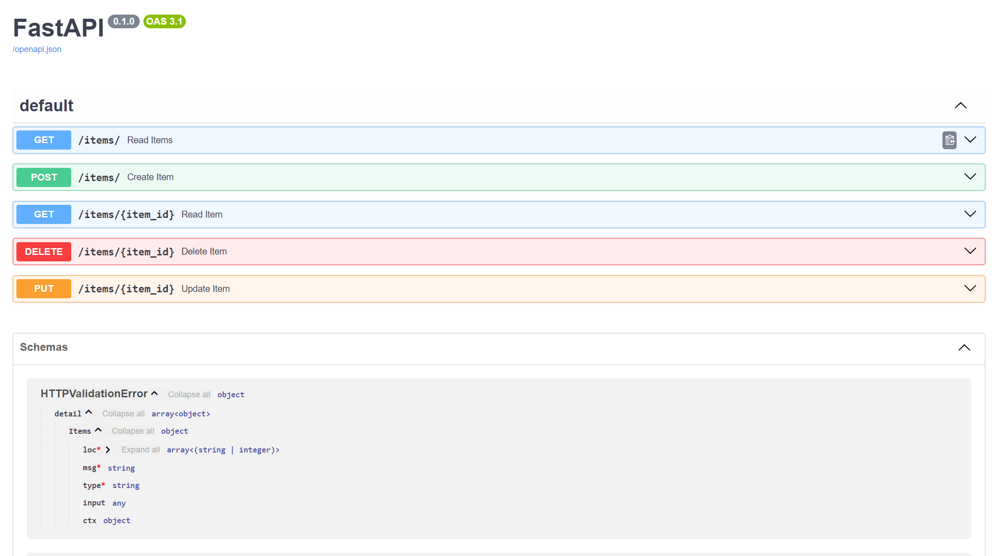

# FastAPI + OpenAI REST API

A RESTful API built with **FastAPI**, featuring a SQLite-backed CRUD layer and **OpenAI ChatCompletion** integration. Built as part of my hands-on transition from Power Platform development to Agentic Engineering.

---

## Project Structure

```
fastapi-openai-rest-api/
├── main.py              # FastAPI app, routes, middleware, error handling
├── sqlIntegration.py    # SQLite database setup and CRUD logic (SQLAlchemy)
├── openaiInt.py         # OpenAI ChatCompletion integration
├── tests/
│   ├── openai_test.py   # Tests for OpenAI /chat endpoint
│   └── sqlInt_test.py   # Tests for CRUD endpoints
└── .gitignore
```

---

## Features

- ✅ Full **CRUD API** for `items` — Create, Read, Update, Delete
- ✅ **SQLite** database via SQLAlchemy (`sqlIntegration.py`)
- ✅ **OpenAI ChatCompletion** endpoint (`openaiInt.py`)
- ✅ Request logging **middleware**
- ✅ **HTTPException** error handling
- ✅ Automated **tests** with `pytest` and FastAPI `TestClient`
- ✅ Auto-generated interactive docs via **Swagger UI** at `/docs`

---

## Swagger UI



---

## Tech Stack

| Tool | Purpose |
|------|---------|
| FastAPI | Web framework |
| SQLite + SQLAlchemy | Database & ORM |
| Pydantic | Request/response validation |
| OpenAI Python SDK | ChatCompletion API |
| pytest + TestClient | Automated testing |

---

## Getting Started

### 1. Clone the repository

```bash
git clone https://github.com/ValeriaRunets/fastapi-openai-rest-api.git
cd fastapi-openai-rest-api
```

### 2. Create and activate virtual environment

```bash
python -m venv venv

# Windows
venv\Scripts\activate

# Mac/Linux
source venv/bin/activate
```

### 3. Install dependencies

```bash
pip install "fastapi[standard]" openai sqlalchemy pytest
```

### 4. Add your OpenAI API key

Create a `.env` file in the root:

```
OPENAI_API_KEY=your_key_here
```

### 5. Run the server

```bash
fastapi dev sqlIntegration.py
```

Open your browser at: **http://localhost:8000/docs**

---

## Running Tests

```bash
pytest tests/
```

---

## API Endpoints

| Method | Endpoint | Description |
|--------|----------|-------------|
| GET | `/items` | Get all items |
| GET | `/items/{id}` | Get item by ID |
| POST | `/items` | Create a new item |
| PUT | `/items/{id}` | Update an item |
| DELETE | `/items/{id}` | Delete an item |
| POST | `/chat` | Chat with OpenAI |

---
